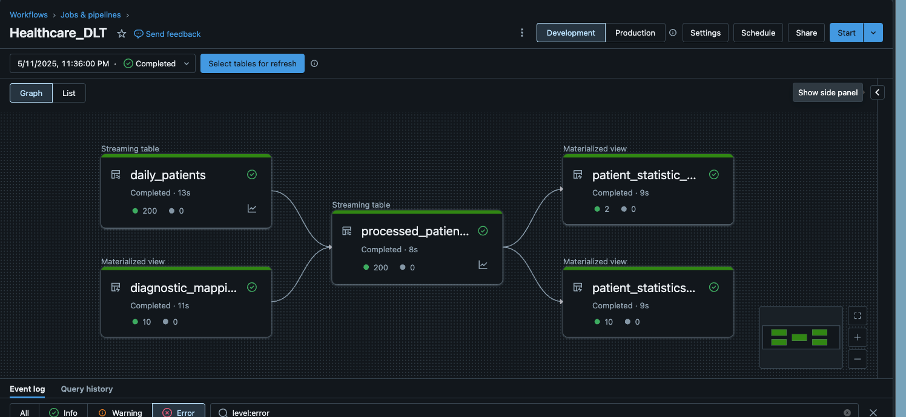
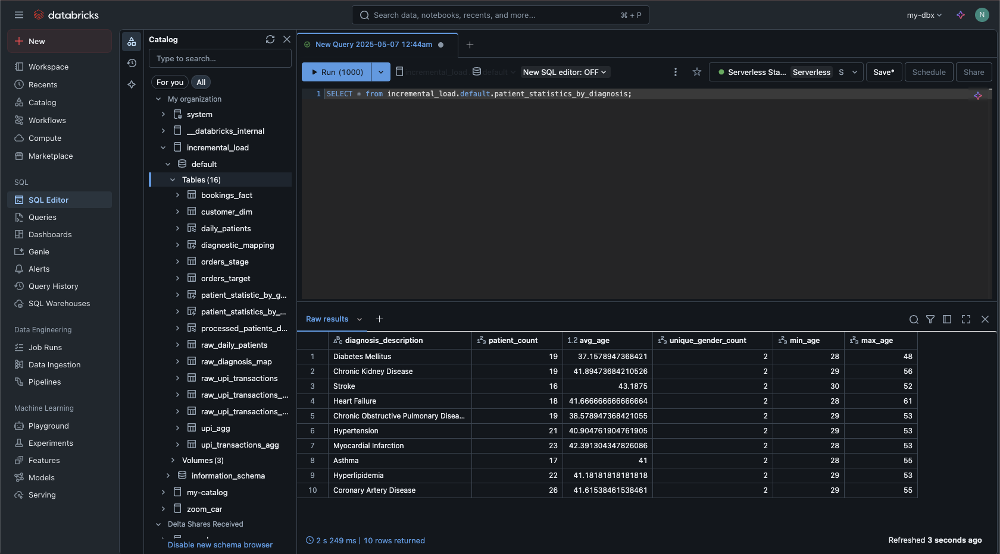
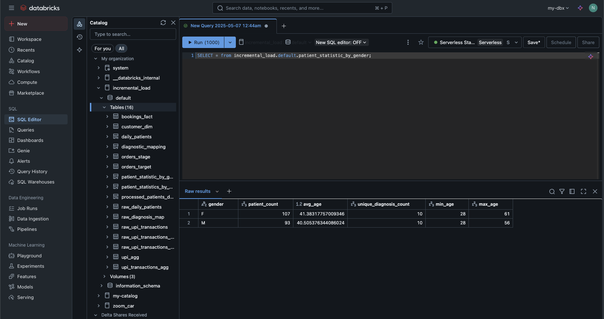

# 🏥 Healthcare DLT Pipeline Project

This project showcases a real-world implementation of a **Databricks Delta Live Tables (DLT)** pipeline using healthcare data. It includes raw data ingestion, transformation through Bronze and Silver layers, and advanced aggregations in the Gold layer for reporting and analysis.

---

## 📁 Project Structure

```bash
healthcare/
├── raw_data.ipynb                   # Simulates ingestion of raw healthcare data
├── healthcare-dlt-pipeline.ipynb    # Main DLT pipeline definition and transformations
├── pipeline.json                    # Configuration file for DLT pipeline deployment
├── screenshots/                     # Visuals of the pipeline and final gold outputs
│   ├── etl_pipeline.png
│   ├── gold_stats_by_diagnosis.png
│   ├── gold_stats_by_gender.png
```

---

## 🔁 Workflow Overview

### 1. `raw_data.ipynb`
- Reads and simulates ingestion of daily patient data.
- Stores raw data in Delta format.
- Creates foundational tables to be used in downstream processing.

### 2. `healthcare-dlt-pipeline.ipynb`
- Implements Bronze → Silver → Gold architecture.
- **Bronze**: Ingests raw data from the Delta table and performs minimal transformations.
- **Silver**: Cleanses data, performs type casting, and prepares structured tables.
- **Gold**: Generates aggregate statistics grouped by gender and diagnosis.

---

## 🖼️ Visual Pipeline Flow

### ETL Pipeline Architecture


### Gold Layer Aggregations

- **Stats by Diagnosis**
  

- **Stats by Gender**
  

---

## ⚙️ Tech Stack

- **Databricks**
- **Delta Live Tables (DLT)**
- **Apache Spark (PySpark)**
- **Delta Lake**
- **Python**

---

## 📌 How to Run

1. Upload `raw_data.ipynb` and execute it to generate raw Delta tables.
2. Use `pipeline.json` to configure your DLT pipeline on Databricks.
3. Deploy and trigger the pipeline using the Databricks UI or CLI.
4. Monitor transformations and output in the Databricks workspace.